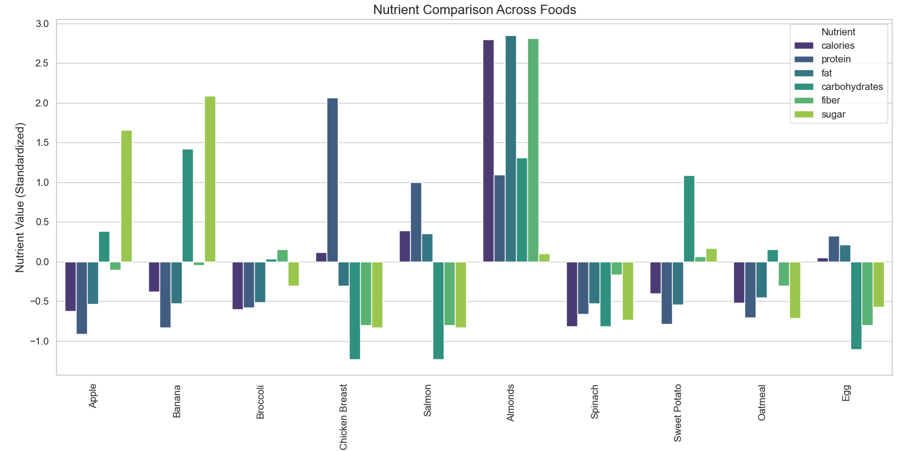

# Nutrient Comparison Across Foods

This project aims to compare the nutrient content of various foods by visualizing their standardized nutrient values. The comparison helps in understanding the nutrient profile of different foods, making it easier to make healthier choices.

## Table of Contents

- [Introduction](#introduction)
- [Data Collection](#data-collection)
- [Feature Engineering](#feature-engineering)
- [Analysis and Visualization](#analysis-and-visualization)
- [Results](#results)
- [Usage](#usage)

## Introduction

In this project, we analyze the nutrient content of various foods using a dataset of food nutrients. The analysis includes standardizing nutrient values and visualizing these metrics for better comparison.

## Data Collection

We use a dataset containing nutrient information for various foods. The dataset should include the following columns:
- `food_name`
- `calories`
- `protein`
- `fat`
- `carbohydrates`
- `fiber`
- `sugar`

## Feature Engineering

The analysis includes calculating the following features:
- Standardized values for each nutrient (calories, protein, fat, carbohydrates, fiber, sugar).

## Analysis and Visualization

The data is analyzed and visualized using various plots:
- Bar plot of standardized nutrient values for all foods.

## Results

The results of the analysis are visualized through the following plots:
- **Nutrient Comparison Across Foods**: A bar plot showing the standardized nutrient values for all foods.

