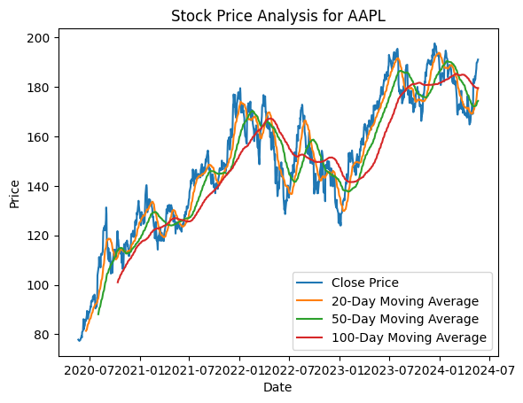
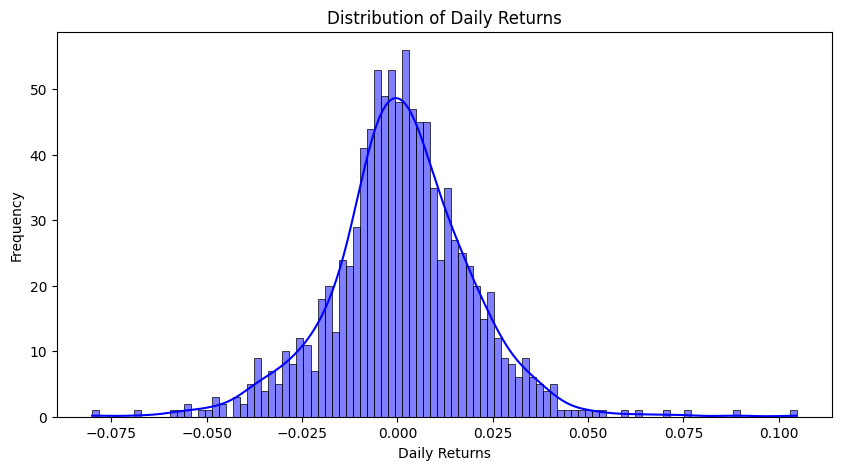
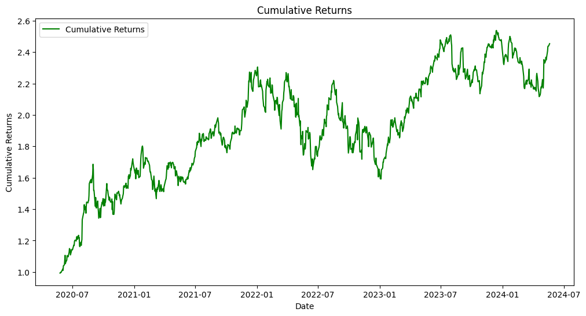

# Apple Stock Price Analysis

This project aims to analyze and visualize Apple (AAPL) stock prices using historical data and various statistical methods.

## Table of Contents

- [Introduction](#introduction)
- [Data Collection](#data-collection)
- [Feature Engineering](#feature-engineering)
- [Analysis and Visualization](#analysis-and-visualization)
- [Results](#results) 
- [Usage](#usage)

## Introduction

In this project, we analyze Apple Inc.'s stock prices using historical data fetched from Yahoo Finance. The analysis includes calculating moving averages, daily returns, and cumulative returns, along with visualizations of these metrics.

## Data Collection

We use the Yahoo Finance API to collect historical stock prices for Apple Inc. (AAPL) for the past four years.

## Feature Engineering

The analysis includes calculating the following features:
- 20-day, 50-day, and 100-day moving averages.
- Daily returns as the percentage change in the closing price.
- Cumulative returns over the specified period.

## Analysis and Visualization

The data is analyzed and visualized using various plots:
- Line plot of closing prices and moving averages.
- Histogram and KDE plot of daily returns.
- Line plot of cumulative returns.

## Results

The results of the analysis are visualized through the following plots:
- **Stock Prices and Moving Averages**: A line plot showing the closing prices and the 20-day, 50-day, and 100-day moving averages.

- **Distribution of Daily Returns**: A histogram with a kernel density estimate showing the distribution of daily returns.

- **Cumulative Returns**: A line plot showing the cumulative returns over the analysis period.

