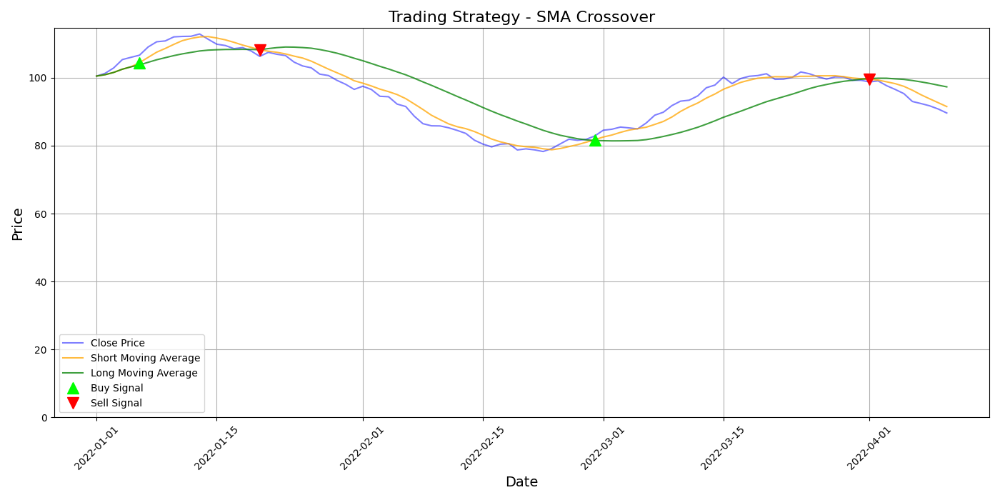

# Algorithmic Trading Bot Using Simple Moving Average (SMA) Strategy

This project implements an **Algorithmic Trading Bot** that uses a **Simple Moving Average (SMA)** crossover strategy to generate buy and sell signals for stock trading.

## Features

- **SMA Calculation**: Automatically calculates short-term and long-term moving averages based on closing prices.
- **Signal Generation**: Generates buy and sell signals based on the crossover of the short and long moving averages.
- **Visualization**: Plots the stock prices, moving averages, and buy/sell signals for easy analysis.

## How It Works

- **Stock Data:** Simulated stock price data is generated, representing the closing prices over time.

- **Signal Generation:** The bot calculates the short and long moving averages and generates buy/sell signals based on their crossovers.

- **Plotting:** Visualizes the stock prices and the calculated moving averages along with buy and sell signals.

## Output
The output will display a plot of the stock price with SMA lines and indicators for buy/sell signals:

### Prerequisites

- **Python**
- **Numpy**
- **Pandas** 
- **Matplotlib** 

