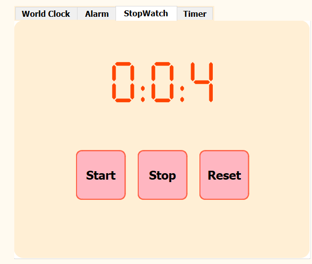
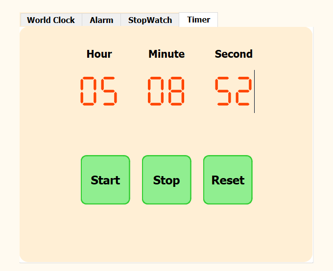
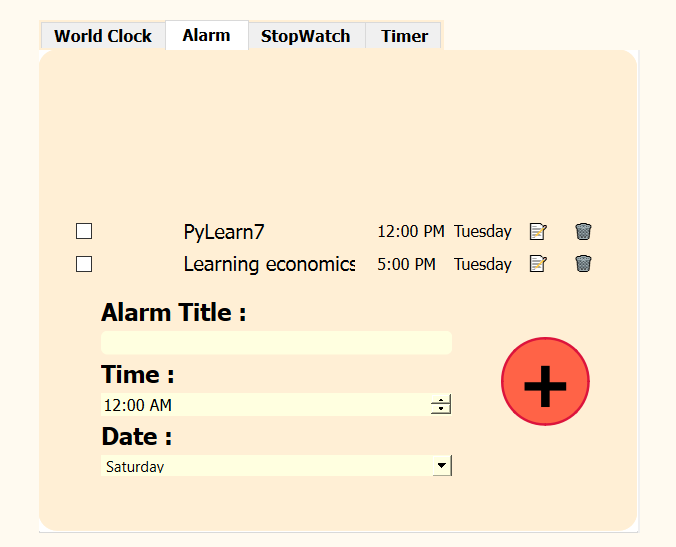

# Multi-Functional Clock Application

This project is a multi-functional clock application built using Python and PySide6. It includes features such as a stopwatch, timer, world clock, and alarm system.

## Features

- **Stopwatch**: Start, stop, and reset the stopwatch.
 


- **Timer**: Set a timer with hours, minutes, and seconds. Start, stop, and reset the timer.
  

- **World Clock**: Display the current time in Iran, Germany, and the USA.
  

- **Alarm System**: Add, edit, and delete alarms with a specified time and date.
  


## Installation

1. Clone the repository:
    ```sh
    git clone https://github.com/MrMZ1010/PyLearn7.git
    cd GUI/Clock
    ```

2. Create and activate a virtual environment:
    ```sh
    python -m venv venv
    source venv/bin/activate # On Windows use `venv\Scripts\activate`
    ```

3. Install the required packages:
    ```sh
    pip install -r requirements.txt
    ```

## Usage

1. Run the application:
    ```sh
    python main.py
    ```

2. Use the tabs to navigate between the stopwatch, timer, world clock, and alarm features.

## Dependencies

- PySide6
- plyer
- fontTools

## Project Structure

- `main.py`: The main entry point of the application.
- `my_time.py`: Contains the `MyTime` class.
- `timer.py`: Contains the `TimerThread` class.
- `stopwatch.py`: Contains the `StopWatchThread` class.
- `world_clock.py`: Contains the `WorldTimeThread` class.
- `main_window.py`: Generated UI file from Qt Designer.
- `database.py`: Contains the `Database` class for managing alarms.
- `alarm.py`: Contains the `Alarm` class for the alarm system.

## Contributing

Contributions are welcome! Please fork the repository and create a pull request.


